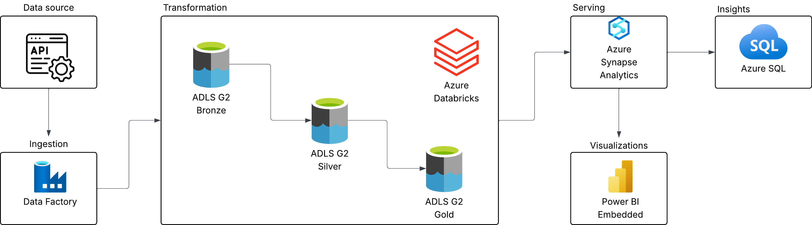

# Earthquake Data Engineering Project Leveraging Azure Services

This project is a data engineering leveraging the Azure services to build a scalable data pipeline in Azure, namely Databricks, Azure Data Factory, and Synapse Analytics.

## Architecture

This is the architecture of the project

The pipeline is designed to follow Medallion Architecture.

## Summary

The tutorial guides you through setting up the core Azure services — Databricks, ADLS Gen2 storage, Synapse Analytics, and Data Factory — and securely connecting them using managed identities and IAM role assignments. You then build three Python notebooks in Databricks that progressively clean and enrich raw earthquake data from the USGS API across bronze, silver, and gold storage layers following a Medallion architecture. Finally, the notebooks are orchestrated into an automated daily pipeline using Azure Data Factory, with the processed data queryable via Synapse Analytics and visualisable in Power BI.

## Brief guide
Assuming the user has access to Azure account, user will need to activate Databricks Workspace, the storage account (ADLS Gen2), and Synapse Analytics Workspace.

1. Deploy the 3 containers in ADLS G2: Bronze, Silver, and Gold.
2. Create your clusters in Databricks Workspace.
3. Connect Databricks to ADLS G2.
4. Build/upload the notebooks in Databricks.
5. Create Azure Data Factory pipeline and connect the notebooks. Remember to pass the parameters from one notebook to another.
6. Schedule the pipeline with a trigger.
7. Finally, connect the Synapse Analytics to ADLS G2 to SQL queries and Power BI.
